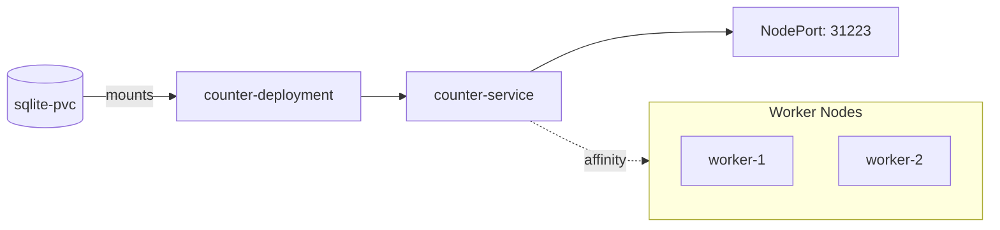

# Pulumi Go – Kubernetes Counter Service
Provision a stateful counter service on Kubernetes with Pulumi and Go.

## Description
This repository contains a Pulumi program written in Go that provisions a Kubernetes workload consisting of a PersistentVolumeClaim, a Deployment, and a Service for a simple counter micro-service. It leverages Infrastructure as Code (IaC) to ensure reproducible deployments, utilizing stateful storage for the counter data, node affinity to target worker nodes, and automatic NodePort allocation for external access.

## Architecture


### Components
- **PersistentVolumeClaim (`sqlite-pvc`)**: 1Gi storage using the `microk8s-hostpath` storage class for SQLite persistence.
- **Deployment (`counter-deployment`)**: Runs `ghcr.io/sidpalas/devops-directive-kubernetes-course/counter-service:v1.0.0` with node affinity for `node-role.kubernetes.io/worker=true`.
- **Service (`counter-service`)**: A `NodePort` service exposing the application on port 8080.

## Prerequisites
- Go 1.25+
- Pulumi CLI v3.x
- Pulumi Kubernetes SDK v4.x
- Access to a Kubernetes cluster (e.g., MicroK8s)
- Docker (for pulling the container image)
- `kubectl` (optional, for manual inspection)

Note: The following needs to be installed (it is just for buildpack, not pulumi):
```bash
# 1. Add the official PPA
sudo add-apt-repository ppa:cncf-buildpacks/pack-cli

# 2. Update and Install
sudo apt-get update
sudo apt-get install pack-cli
```

## Getting Started
1. **Clone the repo**
   ```bash
   git clone <repository-url>
   cd pulumiEval
   ```
2. **Install dependencies**
   ```bash
   go mod tidy
   ```
3. **Login to Pulumi**
   ```bash
   pulumi login
   ```
4. **Create/Select a stack**
   ```bash
   pulumi stack init dev
   ```
5. **Deploy**
    ```bash
    pulumi up
    ```

**Note:** For MicroK8s deployments, the `pulumi up` command may require you to run `sudo echo 1` beforehand **or** add the following line to `/etc/sudoers` (via `sudo visudo`):

```
<user> ALL=(ALL) NOPASSWD: /snap/bin/microk8s ctr images import -
```
6. **Verify**
   ```bash
   kubectl get pvc,pod,svc
   ```

## Usage
Once deployed, find the allocated NodePort:
```bash
pulumi stack output nodePort
```
Interact with the service:
```bash
curl http://<node-ip>:<nodePort>/hits
```

## Testing
The project uses Pulumi mocks to validate resource creation without requiring a live cluster.
```bash
go test./...
```
The tests verify the instantiation of the PVC, Deployment, and Service.

## Project Structure
```
├─ go.mod
├─ go.sum
├─ main.go          # Pulumi program entry point
├─ main_test.go     # Pulumi mocks & unit tests
```

## Configuration
- `kubernetes:context`: Used to select the target kubeconfig context.

## Clean-up
To remove all resources created by the stack:
```bash
pulumi destroy
```

## Contributing
1. Fork the repository.
2. Create a feature branch.
3. Run `go test./...` to ensure no regressions.
4. Submit a Pull Request.

## License
MIT License

## References
- [Pulumi Go SDK](https://www.pulumi.com/docs/languages-go/)
- [Kubernetes Documentation](https://kubernetes.io/docs/)

## Current Progress

The Go Counter Server has been implemented in `counter/main.go` using `http.NewServeMux`.

The server handles `GET /hits` and `POST /hits` and persists data using the SQLite DB in `counter/db.go`.

Unit tests for the server and DB are implemented and passing.

The current infrastructure in `main.go` is set up for a Kubernetes Deployment and Service.

Everything works end to end:

### Pulumi Deployment & Smoke Test Results
#### 1. Pulumi Stack Update

Type                               Name                Status            
pulumi:pulumi:Stack                pulumiEval-dev      
~ ├─ kubernetes:core/v1:Service      counter-service     updated (10s)
+ └─ kubernetes:apps/v1:Deployment   counter-deployment  created (1s)

Outputs:
  deployedImage: "counter-server:latest"
  nodePort     : 31223

### 2. Cluster Resource Status
####  Persistent Volume Claim (Storage)

Resources:
+ 1 created
~ 1 updated
2 changes. 3 unchanged

Duration: 13s

NAME                               STATUS   VOLUME                                     CAPACITY   ACCESS MODES   STORAGECLASS        AGE
persistentvolumeclaim/sqlite-pvc   Bound    pvc-59f9ea28-2330-47da-a83f-1d1da3383dcd   1Gi        RWO            microk8s-hostpath   6h47m

#### Pods (Application)

NAME                                       READY   STATUS    RESTARTS   AGE   IP            NODE          
pod/counter-deployment-77994d8df9-b8r66    1/1     Running   0          10s   <pod-ip>      <worker-node>

#### Services (Networking)

NAME                      TYPE       CLUSTER-IP       EXTERNAL-IP   PORT(S)        AGE     SELECTOR
service/counter-service   NodePort   <service-ip>     <none>        80:31223/TCP   6h47m   app=counter
service/kubernetes        ClusterIP  <cluster-ip>     <none>        443/TCP        24h     <none>

### 3. Smoke Test Verification
#### Step 1: Check initial count

$ curl -v http://<service-ip>:80/hits
> GET /hits HTTP/1.1
> Host: <service-ip>
...
< HTTP/1.1 200 OK
< Content-Type: application/json
{"hits":0}

#### Step 2: Increment the counter (POST request)

$ curl -X POST -v http://<service-ip>:80/hits
> POST /hits HTTP/1.1
> Host: <service-ip>
...
< HTTP/1.1 204 No Content

#### Step 3: Verify incremented count

$ curl -v http://<service-ip>:80/hits
> GET /hits HTTP/1.1
> Host: <service-ip>
...
< HTTP/1.1 200 OK
< Content-Type: application/json
{"hits":1}

### Status: Smoke test completed successfully. Counter persistence and routing verified.

